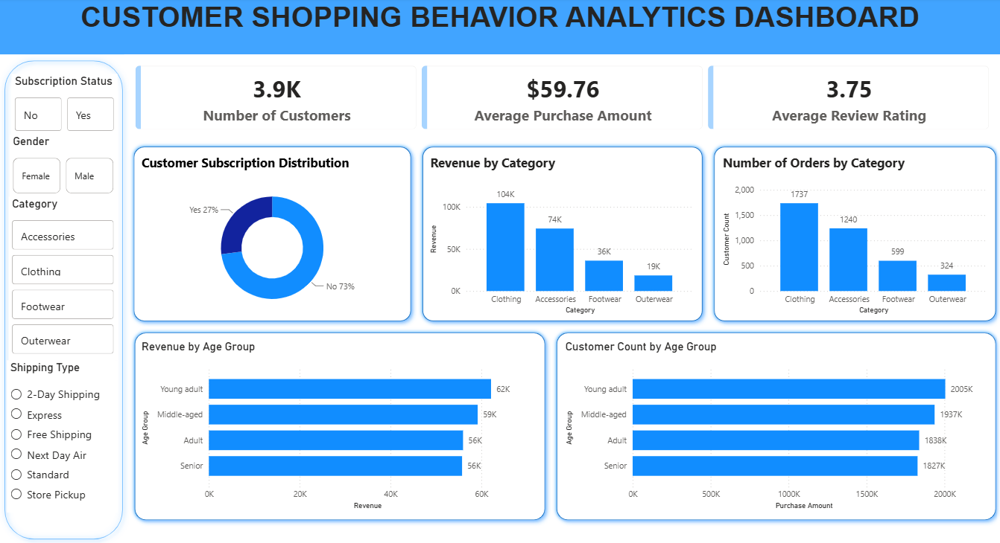

# 🛍️ Customer Shopping Behavior Analysis



## 📖 Project Overview

This project presents an end-to-end data analytics solution for analyzing customer shopping behavior using **Python, MySQL, and Power BI**.

Starting from raw retail transaction data, the project follows a complete analytics workflow including data cleaning, exploratory data analysis (EDA), business-oriented SQL analysis, and interactive dashboard development. The objective is to uncover meaningful insights into customer purchasing patterns, product performance, revenue trends, and customer segmentation to support data-driven business decisions.

---

## 🎯 Objectives

- Clean and preprocess raw customer shopping data
- Perform exploratory data analysis using Python
- Solve real-world business problems using SQL
- Build an interactive Power BI dashboard
- Generate actionable business recommendations

---

## 🛠️ Tech Stack

| Tool | Purpose |
|------|---------|
| Python (Pandas) | Data Cleaning & EDA |
| Jupyter Notebook | Data Exploration |
| MySQL | Business Analysis |
| Power BI | Dashboard & Visualization |
| Git & GitHub | Version Control |

---

## 📂 Repository Structure

```text
Customer-Shopping-Behavior-Analysis
│
├── dashboard
│   ├── Customer_Shopping_Behavior_Dashboard.pbix
│   └── customer_shopping_dashboard.png
│
├── dataset
│   ├── customer_shopping_behavior.csv
│   └── customer_shopping_behavior_cleaned.csv
│
├── notebooks
│   └── customer_shopping_behavior_analysis.ipynb
│
├── presentation
│   └── Customer_Shopping_Behavior_Presentation.pptx
│
├── report
│   └── Customer_Shopping_Behavior_Analysis_Report.pdf
│
├── sql
│   └── customer_shopping_behavior_analysis.sql
│
└── README.md
```

---

## 📊 Dataset Information

- **Dataset Size:** 3,900 customer shopping records
- **Features:** 18 columns
- **Domain:** Retail / Customer Shopping
- **Data Source:** Kaggle

The dataset contains customer demographics, product information, purchase details, subscription status, payment methods, shipping preferences, review ratings, discounts, and purchase history.

---

## 🧹 Data Cleaning & Preprocessing

The dataset was cleaned and prepared using Python before analysis.

Key preprocessing steps include:

- Importing and inspecting the dataset
- Handling missing values in the Review Rating column
- Renaming columns using snake_case
- Creating an `age_group` feature
- Removing redundant columns
- Exporting the cleaned dataset for SQL analysis and Power BI

---

## 🗄️ SQL Business Analysis

Using MySQL, multiple business questions were solved to generate actionable insights.

Some of the analyses include:

- Revenue by Product Category
- Revenue by Gender
- Subscribers vs Non-Subscribers Spending
- Top Rated Products
- Top Products within Each Category
- Products with High Sales but Low Ratings
- Revenue by Customer Segment
- Top Customers by Total Spending
- Category-wise Revenue Contribution
- Top Product by Age Group
- Customer Spending Tier Classification

### SQL Concepts Used

- Aggregate Functions
- GROUP BY
- CASE Statements
- Common Table Expressions (CTEs)
- Subqueries
- Window Functions
  - ROW_NUMBER()
  - DENSE_RANK()

---

## 📈 Power BI Dashboard

An interactive dashboard was developed to visualize key business metrics and customer shopping trends.

### Dashboard Features

- KPI Cards
  - Number of Customers
  - Average Purchase Amount
  - Average Review Rating

- Revenue Analysis
- Customer Subscription Distribution
- Orders by Category
- Revenue by Age Group
- Customer Count by Age Group

### Interactive Filters

- Subscription Status
- Gender
- Category
- Shipping Type

---

## 💡 Key Business Insights

- Clothing generated the highest overall revenue.
- Non-subscribed customers contributed a larger share of total revenue.
- Customer spending varies across different customer segments.
- High-value customers were identified using SQL window functions.
- Category-wise revenue contribution helps prioritize business investments.
- Customer segmentation enables personalized marketing and loyalty strategies.

---

## 📁 Project Deliverables

This repository contains:

- 📒 Jupyter Notebook
- 🗃️ MySQL Business Analysis
- 📊 Power BI Dashboard (.pbix)
- 🖼️ Dashboard Preview
- 📄 Project Report
- 🎤 Project Presentation
- 📂 Raw & Cleaned Dataset

---

## 🚀 How to Run

1. Download or clone this repository.
2. Open the Jupyter Notebook to explore the Python workflow.
3. Import the cleaned dataset into MySQL and execute the SQL queries.
4. Open the Power BI (.pbix) file to interact with the dashboard.

---

## ⭐ If you found this project useful, consider giving it a star.
